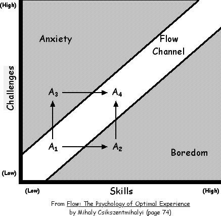

# Fantastic Teacher Project

The **Fantastic Teacher** project, founded in 2018, is dedicated to enhancing the learning experience by leveraging emotional feedback and biometrics. Our mission is to motivate students by tailoring educational content to their emotions, skills, and cognitive states. Through techniques such as facial analysis, reaction speed measurement, and psychological insights, we aim to provide students with the highest quality educational materials.

## Our Methodology

At the heart of our approach is the belief that a student's enthusiasm and engagement are essential for effective learning. We strive to help students achieve a state of flow, where their skills align with the complexity of the task at hand. 

**Flow** is a mental state characterized by complete immersion, intense focus, and a sense of accomplishment during an activity. We achieve this by dynamically adjusting the difficulty of learning tasks based on the student's position in the "difficulty/skills" matrix.

Using emotions as indicators, we determine where a student stands on the "difficulty/skills" matrix. Emotions can be recognized through camera-based analysis, allowing us to provide personalized learning experiences.

## Current State of the Project

We are actively collaborating with the **Biometric Technologies Laboratory** at the University of Calgary, [Learn More](https://www.ucalgary.ca/labs/biometric-technologies/home), to explore the feasibility and effectiveness of our project's approaches.

Furthermore, we offer companies the opportunity to implement aspects of our methodology into their IT systems, as demonstrated by our example implementation at [didactic.chat](https://didactic.chat).

Investment opportunities are presently being pursued to support the growth and expansion of our innovative educational platform.

For inquiries or to get involved, please contact us at [denischergicalo@gmail.com](mailto:denischergicalo@gmail.com).

Thank you for your interest in the Fantastic Teacher Project. Together, we can revolutionize education through emotion-driven learning.
